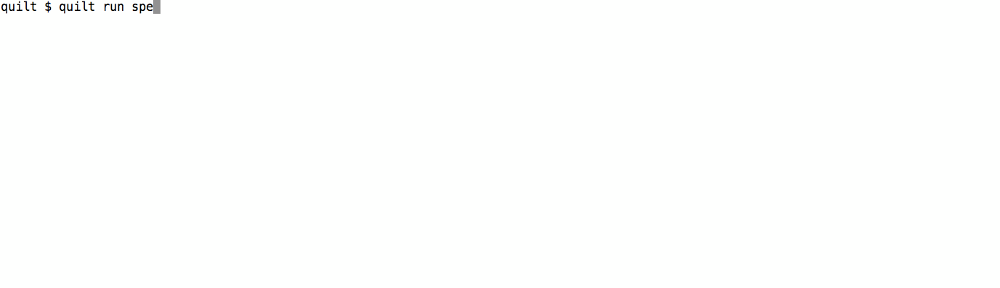

## Deploying your MEAN stack app with Quilt
Let's deploy the very simple MEAN stack app located in [github.com/LuiseV/awesome-restaurant-app](https://github.com/LuiseV/awesome-restaurant-app.git).

The MEAN stack (MongoDB, Express, AngularJS, and node.js) is a popular fullstack JavaScript framework used for web development. Deploying a flexible, multi-node MEAN stack app can be both time consuming and costly, but Quilt simplifies this process.

The [`specs/mean`](./specs/mean) directory in the Quilt repository already contains the code for deploying the multi-node MEAN stack that we will use for our `awesome-restaurant-app`. All we have to do is tweak a few lines of code in the [`quilt/specs/mean`](./specs/mean) directory, to ensure that _our_ application is deployed. Specifically we will make changes to the following files:

* [`specs/mean/Dockerfile`](./specs/mean/Dockerfile) (1 line)
* [`specs/mean/Makefile`](./specs/mean/Makefile) (1 line)
* [`specs/mean/app.js`](./specs/mean/app.js) (1 line)
* [`specs/mean/example.js`](./specs/mean/example.js) (1 line)

Let's get started!

### How to

##### Our app

First, we make sure that our MongoDB connection URI is set to the `MONGO_URI` environment variable. E.g.:

    var mongoose = require('mongoose');
    mongoose.connect(process.env.MONGO_URI);

##### specs/mean/Dockerfile

In [`specs/mean/Dockerfile`](./specs/mean/Dockerfile), we change the `git clone` command to clone the Github repository that contains our app.

    RUN git clone https://github.com/LuiseV/awesome-restaurant-app.git .

##### specs/mean/Makefile

Change the `REPO` constant in [`specs/mean/Makefile`](./specs/mean/Makefile) so it points to our container registry repository (e.g. on [Docker Hub](https://hub.docker.com/)). This way we will push and pull our application image to/from our personal repository.

    REPO = luise/awesome-restaurant-app

##### Build and Push Image
In the [`specs/mean`](./specs/mean) directory, run `make push-image`. This will build an image from the Dockerfile we just modified, and push the resulting image to our image registry repository.

    $ make push-image
    The push refers to a repository [docker.io/luise/awesome-restaurant-app]
    ...

The above step requires that Docker is installed and running, and that we're authenticated. Check out [Docker's website](https://docs.docker.com/engine/installation/) for more.

##### specs/mean/app.js

With the image in pushed, we change the `image` variable in [`specs/mean/app.js`](./specs/mean/app.js) to point to our docker image. This ensures that our application containers will be created from the image we just built.

    var image = "luise/awesome-restaurant-app";

##### specs/mean/example.js

Finally, before we deploy our MEAN stack, lets set the `githubKeys` property in [`specs/mean/example.js`](./specs/mean/example.js). By setting `githubKeys` to be our Github username, we can ssh into the VMs in our deployment using any ssh key associated with our Github profile.

    var baseMachine = new Machine({
        ...
        sshKeys: githubKeys("luisev"),
    });

##### Deploy
Now we're ready to deploy our MEAN stack application! In one terminal window, run `quilt daemon`, and in another terminal, run `quilt run specs/mean/example.js` - both from the `quilt` directory. You should see something like this:

    $ quilt daemon
    INFO [Nov  1 20:18:28.133] db.Cluster:
        Cluster-1{Namespace=luise}
    INFO [Nov  1 20:18:28.133] db.Machine:
        Machine-2{Master, Amazon us-west-1 c4.large, Disk=32GB}
        Machine-3{Worker, Amazon us-west-1 c4.large, Disk=32GB}
        ...

and 

    $ quilt run specs/mean/example.js
    Successfully started run.

The VMs are fully booted when it says `Connected` in the daemon log. You can get useful information about the running VMs and containers with the commands `quilt machines` and `quilt containers`. When `quilt containers` shows us that all three `luise/awesome-restaurant-app` and all three `quilt/haproxy` containers are running, our app is up!

##### Access Web App
We can now access our web app by using the public IP addres of any worker machine. We can get the public IP of a worker machine from the quilt daemon log or the output of `quilt machines`. The following shows that there is a Worker VM at the public IP address 52.53.236.192:

    Machine-2{Master, Amazon us-west-1 c4.large, sir-zvrrcvfk, PublicIP=54.67.106.64, PrivateIP=172.31.10.253, Disk=32GB}
    Machine-7{Worker, Amazon us-west-1 c4.large, sir-cpf8c81k, PublicIP=52.53.236.192, PrivateIP=172.31.15.56, Disk=32GB}

Now, simply go to `WORKER_PUBLIC_IP:80` in your browser. As you see, our app is up!

##### Shut Down VMs
To shut down our application and VMs, run `quilt stop`, and wait for the message `Successfully halted machines.` in the quilt daemon output.

### Notes

Floating IPs are in progress and will be released soon.
